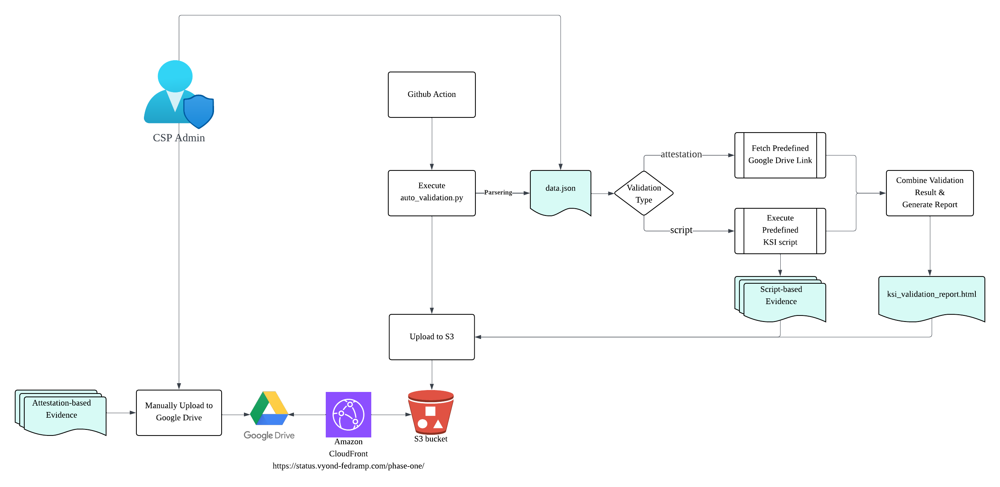

# Vyond for Government (V4G) – FedRAMP 20x Phase One Submission

Welcome to the V4G FedRAMP 20x Phase One Submission. This repository provides a structured and auditable interface for FedRAMP assessors and stakeholders to review Key Security Indicators (KSI) as required by the FedRAMP 20x standards.

---

## 🔧 Overview

This repository includes an automated pipeline that verifies KSI requirements outlined in the FedRAMP 20x program.

- Reference: [FedRAMP 20x KSI Standard](https://www.fedramp.gov/20x/standards/20x-ksi/)
- Submission Dashboard: [status.vyond-fedramp.com](https://status.vyond-fedramp.com/phase-one/)
- Submission Presentation Deck: [FedRAMP 20x Pilot – Rationale.pptx](https://docs.google.com/presentation/d/1X2pSOBdoKqAULimb-EQDO50S9bP_VKQQ/edit?usp=sharing)

---

## 📦 Contents of This Repository

- `.github/workflows/` — GitHub Actions workflow to automate the pipeline
- `3pao-kratos/` — Documents related to 3PAO review and assessment by Kratos, including methodology overview and letter of attestation
- `scripts/` — Bash scripts to validate specific controls
- `auto_validation.py` — Main Python script for validation and generate a human-readable HTML summary report based
- `data.json` — JSON configuration for all KSI items and their validation definitions

---

## ♻️ Automation

A GitHub Actions workflow is scheduled to run regularly to:

- Execute a Python-based validation script that checks eligible KSI controls
- Parse the `data.json` configuration and identify all KSI items with `"type": "script"`
- For each such item, extract the associated shell script path (e.g., `./script/KSI-CNA-3.sh`) from the `ref` field and execute it
- Generate a human-readable HTML summary report based on the validation results
- Upload both the report and evidence artifacts to an S3 bucket via secure FIPS encryption

### Example from `data.json`:

```json
{
  "type": "script",
  "ref": [
    {
      "script": "./script/KSI-CNA-3.sh"
    }
  ]
}
```

---

## ✋ Manual Uploads

For KSI that cannot be programmatically validated (e.g., attestation-only items), evidence files are uploaded manually to the V4G’s Google Drive for centralized access.

These manual uploads are primarily used to verify KSI controls where the validation `type` is defined as `"attestation"` in [`data.json`](./data.json). Each attestation-based KSI includes a `ref` section listing links to evidence artifacts such as screenshots, PDFs, or documents submitted for assessment.

### Example from `data.json`:

```json
{
  "type": "attestation",
  "ref": [
    {
      "text": "KSI-CNA-4-Instance Profile.png",
      "link": "https://drive.google.com/file/d/1_R0OD5w3A0Zy4M9enmuISRSORB9kFlBO/view?usp=drive_link"
    },
    {
      "text": "KSI-CNA-4-Git Commit-IaC.png",
      "link": "https://drive.google.com/file/d/1VkIBUSw9dnozyz5Rrb7DEgPkXyBK2gWE/view?usp=drive_link"
    }
  ]
}
```

---

## 🚀 Deployment Architecture

- Automated validation: Script-based evidence and a human-readable HTML summary report generated via the GitHub Action pipeline are automatically uploaded to an S3 bucket
- Manual validation: Attestation-based evidence is manually uploaded to Google Drive for centralized reviewer access
- Update Frequency: Automated validation execite on daily scheduled basis via GitHub Actions. Manual validation evidence is updated manually as needed
- Public access: The S3 bucket is fronted by an AWS CloudFront distribution, accessible via https://status.vyond-fedramp.com/phase-one/



---

## 💼 For Reviewers / Auditors

This Phase One Submission is organized to meet the following FedRAMP 20x expectations:

- Clearly documented Points of Contact
- Public access to the KSI summary view
- Artifacts for verified controls and manual attestations
- Support for continuous monitoring, change management, and incident response
- Optional system diagrams to aid in interpretation

If additional access is required, please contact:
📧 **devops@vyond-fedramp.com**

---

## 🧪 3PAO Review and Assessment

This submission is subject to independent third-party assessment by **Kratos**, a FedRAMP-accredited 3PAO with over a decade of experience in cloud system security validation.

Kratos’s methodology ensures that both automated controls and context-specific architectural nuances are appropriately evaluated, supporting the speed and rigor required under the FedRAMP 20x framework.

Public assessment artifacts:
- [Kratos FedRAMP 20x Methodology](./3pao-kratos/Kratos-FedRAMP-20x-Methodology.pdf)
- [Kratos Letter of Attestation for Security Assessment of V4G on AWS](./3pao-kratos/Kratos-Letter-of-Attestation-for-Security-Assessment-of-V4G-on-AWS.pdf)


---

Thank you for your review and continued collaboration.

